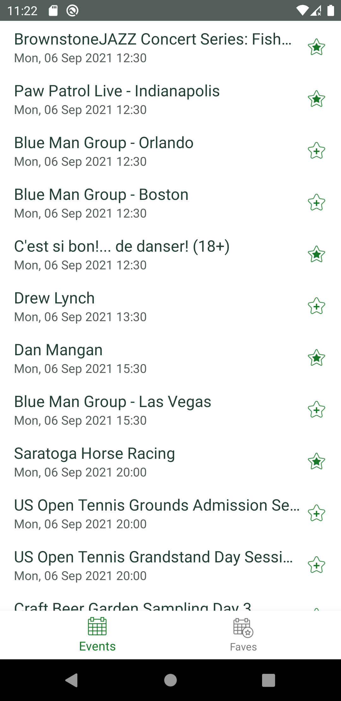
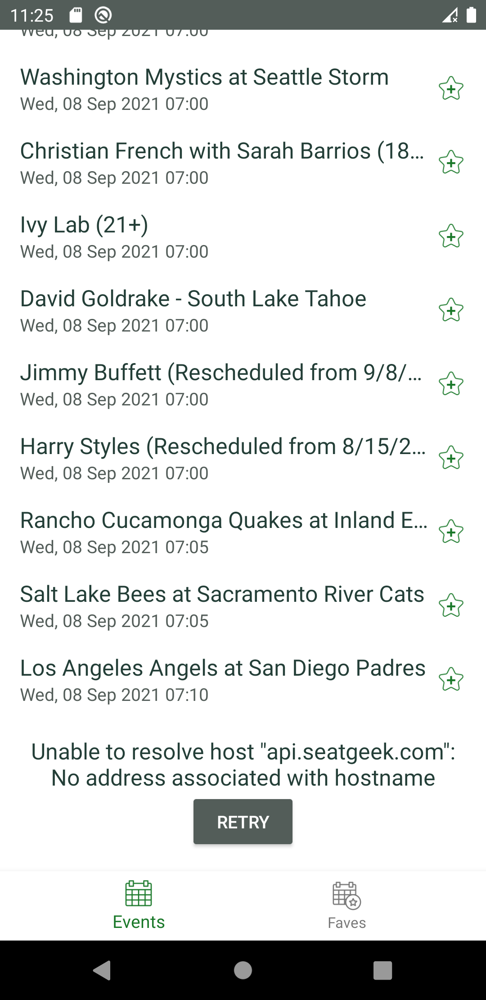
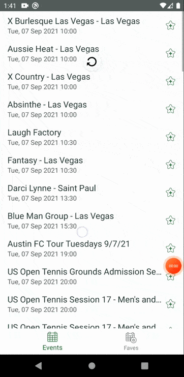
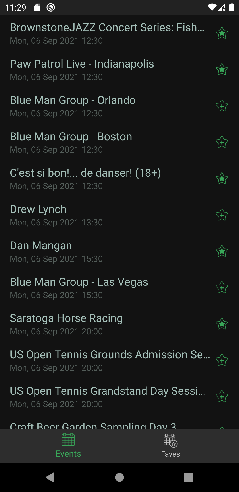
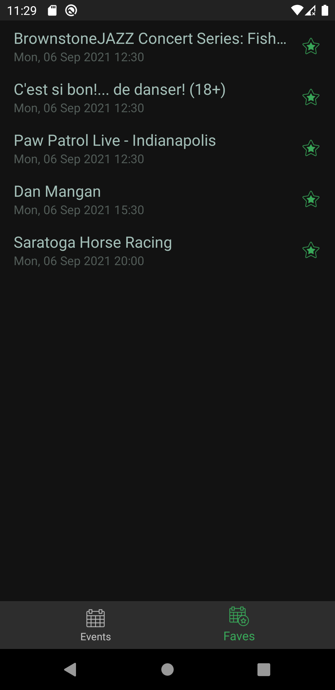
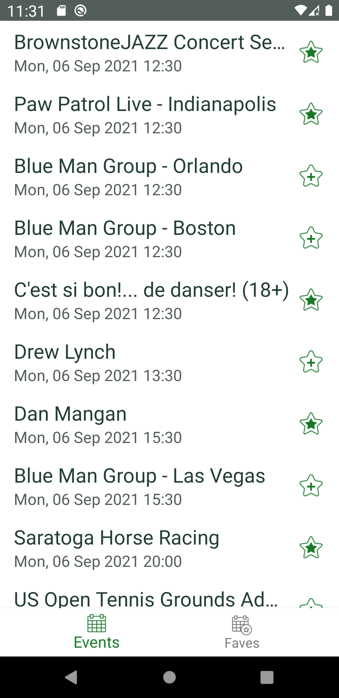
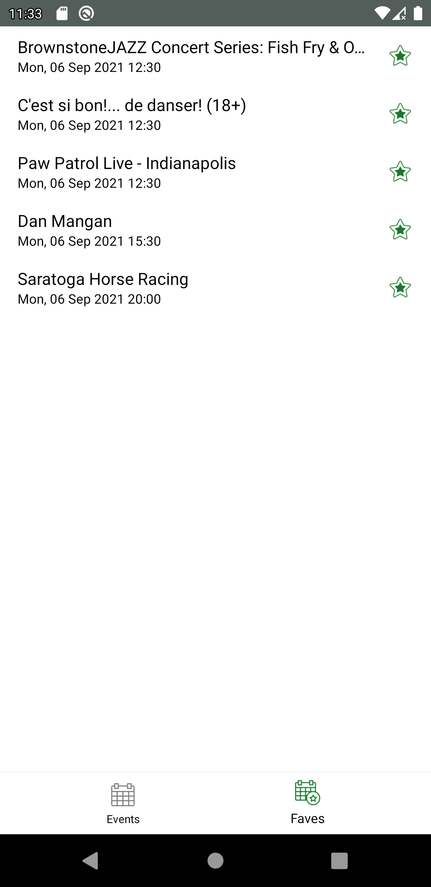

Pet Application
===================

Implementation of the application using the [SeatGeek REST API](https://platform.seatgeek.com/).

```
// You can change the Client ID to your own
it.buildConfigField 'String', 'CLIENT_ID', "\"CLIENT_ID\""
```
### Apk
[Freshly Test apk, release build](data/FreshlyTest.apk)

### Architecture

* MVVM - [Guide to app architecture](https://developer.android.com/jetpack/guide)
* [Kotlin](https://kotlinlang.org/), [Coroutines](https://github.com/Kotlin/kotlinx.coroutines),
  [Flow](https://kotlinlang.org/docs/flow.html)
* [LiveData](https://developer.android.com/topic/libraries/architecture/livedata)

### Demo
* [Demo and Ui Test Running on Youtube](https://www.youtube.com/watch?v=f4Rdyzs4jbM)

### Preview
<p align="center">



</p>

### Dark theme
<p align="center">


</p>

### Accessibility 
<p align="center">



</p>

### Requirements
[Events List Epic Confluence](data/confluence_epic_1.pdf)

[Favourite Events Epic Confluence](data/confluence_epic_2.pdf)

### Guide through the code and requirements
* [Guide through the code and requirements on Youtube](https://www.youtube.com/watch?v=zeji4x3UIS4)

### Libraries

* Accompanist
    * [Swipe Refresh](https://google.github.io/accompanist/swiperefresh/)
    * [Material Components](https://mvnrepository.com/artifact/com.google.android.material/material)
    * [Paging 3.0](https://developer.android.com/topic/libraries/architecture/paging/v3-overview)
    * [Navigation](https://developer.android.com/guide/navigation/navigation-getting-started)
* Dependency Injection
    * [Hilt Compiler](https://developer.android.com/training/dependency-injection/hilt-jetpack#workmanager)
    * [Hilt Android](https://mvnrepository.com/artifact/com.google.dagger/hilt-android)
    * [Hilt Processor](https://mvnrepository.com/artifact/com.google.dagger/hilt-compiler)
* Retrofit2 & OkHttp3
    * [Converter: Gson](https://mvnrepository.com/artifact/com.squareup.retrofit2/converter-gson)
    * [Retrofit](https://mvnrepository.com/artifact/com.squareup.retrofit2/retrofit)
    * [OkHttp Logging Interceptor](https://mvnrepository.com/artifact/com.squareup.okhttp3/logging-interceptor)
* Room Database
    * [Android Room Runtime](https://mvnrepository.com/artifact/androidx.room/room-runtime)
    * [Android Room Kotlin Extensions](https://mvnrepository.com/artifact/androidx.room/room-ktx)
    * [Android Room Compiler](https://mvnrepository.com/artifact/androidx.room/room-compiler)
* Lifecycle
    * [Livedata](https://mvnrepository.com/artifact/androidx.lifecycle/lifecycle-livedata/2.0.0-alpha1)    
    * [View Model](https://mvnrepository.com/artifact/androidx.lifecycle/lifecycle-viewmodel-ktx)    
    * [Runtime](https://mvnrepository.com/artifact/androidx.lifecycle/lifecycle-runtime)    
* Test
    * [JUnit](https://mvnrepository.com/artifact/junit/junit)
    * [Mockito](https://github.com/mockito/mockito)
    * [Kotlin Coroutines](https://kotlin.github.io/kotlinx.coroutines/kotlinx-coroutines-test/)
    * [Mockk](https://mockk.io/)
    * [Robolectric](http://robolectric.org/)
    * [Hilt](https://developer.android.com/training/dependency-injection/hilt-testing)
    * [Espresso](https://developer.android.com/training/testing/espresso)
    * [Retrofit mock](https://mvnrepository.com/artifact/com.squareup.retrofit2/retrofit-mock)
    * [Uiautomator](https://mvnrepository.com/artifact/androidx.test.uiautomator/uiautomator)
    * [Easymock](https://easymock.org/)
* Other
    * [Timber](https://mvnrepository.com/artifact/com.jakewharton.timber/timber)
    * [Android App Startup Runtime](https://mvnrepository.com/artifact/androidx.startup/startup-runtime)
    
# License

```
Copyright 2021 Anna Manzhula

Licensed under the Apache License, Version 2.0 (the "License");
you may not use this file except in compliance with the License.
You may obtain a copy of the License at

    http://www.apache.org/licenses/LICENSE-2.0

Unless required by applicable law or agreed to in writing, software
distributed under the License is distributed on an "AS IS" BASIS,
WITHOUT WARRANTIES OR CONDITIONS OF ANY KIND, either express or implied.
See the License for the specific language governing permissions and
limitations under the License.
```
